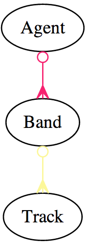
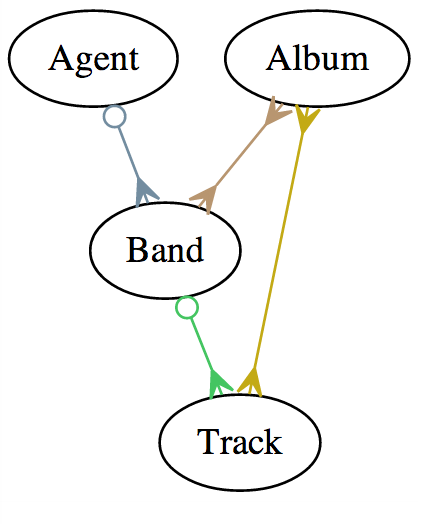
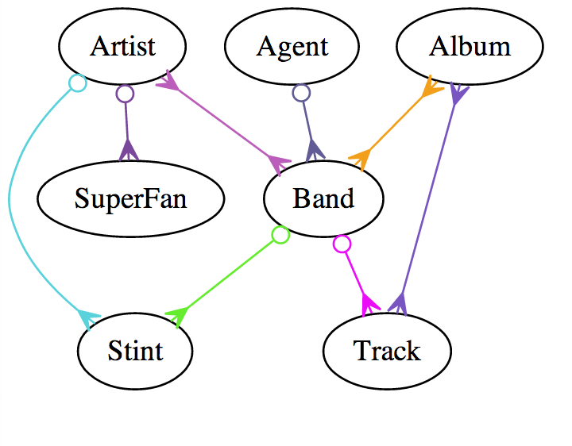

Entity Relationship Diagrams
==================

[_Relationships_](http://clients.stujophoto.com/)

#Objectives
* Explain how associations relate to real world examples
* Recognize an ERD Diagram
	
#Introduction

You're back in the Music business! Following your success on your first gig, you're linked in recommendations have led you to a new job at MooSIQ!

**MooSIQ : Cows love music too**

Contgratulations!

#Entity Relationship Diagrams

* ERDs
* ER Diagrams
* Entity Relationship Diagrams

##ERD: Agents and Bands
__One to Many__

* Real World
  * One `Agent` manages many `Band`s
  * One `Band` is managed by One `Agent`

* ERD
  * `Agent` has_many `Band`
  * `Band` belongs_to `Agent`
  

##ERD: Bands and Tracks

__Another example of One to Many__

* Real World
  * One `Band` releases many `Track`s
  * One `Track` is released by One `Band`

* ERD
  * `Band` has_many `Track`
  * `Track` belongs_to `Band`

##ERD: Tracks and Albums

__Many to Many__

* Real World
  * One `Album` includes many `Track`s
  * One `Track` is released many `Albums`

* ERD
  * `Album` has_many `Track`
  * `Track` has_many `Albums`

##ERD: Bands and Albums
__Many to Many (through)__

* Real World
  * One `Album` includes many `Band`s' `Track`s
  * One `Band` has `Track`s released on many `Albums`

* ERD
  * `Album` has_many `Band` through `Track`s
  * `Band` has_many `Albums` through `Track`s

##ERD: The Full Monty

##ERD: Exercise
You are working on a side project for a local Community College.
Help design the database for student admissions. `Applicants` can apply to any number of `DegreePrograms` with an `Application`, but need to write a separate `Application` for each. Each Application are reviewed by a single `Reviewer` but each `Reviewer` can work on multiple `Applications`

__Entities__

* Applicant
* Application
* DegreeProgram
* Reviewer

* Spend 10 minutes drawing out your ERD
  * What are the relationships
  * What is their type belongs_to or has_many or has_many through
