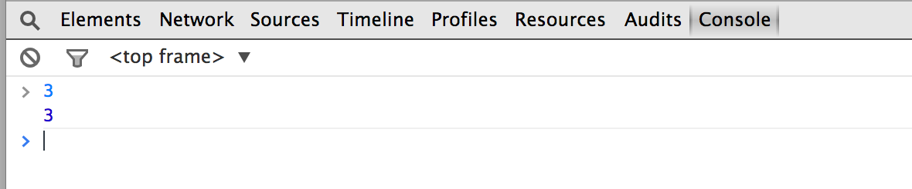
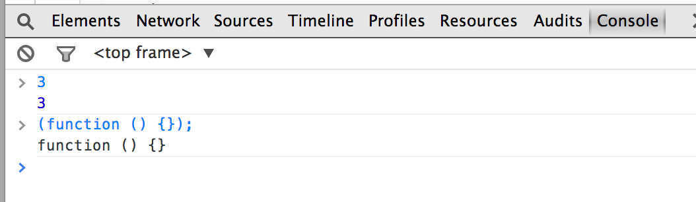

# Intro To Javascript
## Functions


## Objectives

| Objective |
| :--- |
| Student should be able to articulate the major differences between Ruby methods and Javascript functons |
| Students should be able understand how functions capture variables in scope |
| Students should be able nest functions and understand there execution |


## Why Stress JS Functions?

Alex Notov was previous WDI instructor who said it very well when it came to learning a langauge


> *Every programming language has one or two things that you really have to  [`grok`](http://en.wikipedia.org/wiki/Grok) in order to understand the rest of the language and its idioms.*
>
> **Alex Notov**

In Javascript we must *"grok"* functions. This was reflected in student feedback

| **Stephen Bauer** via HipChat |
| :--- |
| *"First real struggle was grasping the concept of functional programming/.../How functions are values and nesting functions within others, etc*" |

When Stephen talks about **functional programming** he's talking about a language *"... [where] you really have to `grok` [functions] in order to understand the rest of the language and its idioms."*

Another student phrased it like this:

| Stuart Stein via HipChat |
| :---- |
| *"Oh, these are just like methods"/"but we can't call them methods"/"or they'll get mad at us."* |

Alex Notov gave examples of this `grok`-ing in other languages:

> * In Ruby **everything** is an object 
> * In Java you can't do anything without declaring a class
> * In C or C++ you to understand pointers


## Feedback On This Lesson 

| Stephen Bauer via HipChat |
| :--- |
| *What I remember from that lesson is that the exercises were engaging enough; he let us knock our heads against the concepts he was outlining*|


### Self-Assesment 

The goal of this lesson is to be able to understand why the function below always returns `true` regardless of the value.

```
(function (value) {
  return (function (copy) {
    return copy === value;
  })(value);
})("Hello World");

(function (value) {
  return (function (copy) {
    return copy === value;
  })(value);
})([1, 2, 3]);
```


## Outline

* Functions as JS values
	* Brainstorm: values in Ruby
* Functions are a reference
	* values vs reference
* Parts of a function
	* arguments
	* return 
	* exercise
* Working Toward A Complicated Example
	* Recall the goal
	* arguments and parameters
		* applying more values
	* What about environments? 
		* description exercise
		* Free variable discussion
	* Function Naming
		* function expressions
		* function declarations
* Namespacing
	* Object literals
		* key, val pairs
	* Modules 
	
	

## Functions as JS values

Type `3` in the chrome JS console. You should get three back. 

The console returns the value `3`.

If we type in

```
(function () {});
```

<i name="example_1_q">What do you see?</i> <a href="#example_1">solution</a>

### Brainstorm: values in Ruby

<i name="brainstorm_1_q">What can you do with values in Ruby?</i>

* <a href="#brainstorm_1">brainstorm</a>

When it comes to ruby passing values around between methods becomes a powerful feature.


## Functions as a reference type

Before we do anything with functions, let's talk about their type. Hmmm?

Earlier we talked about the difference between value types and reference types.

Let's try the following test we used for checking references in the JS console:

```
(function () {}) === (function () {});
```

### values vs references

Recall that a value returns true when compared with something that is equivalent to it. However, we found out that just because two arrays may be **equivalent** that *does not mean they are equal* in JS, because each is a different reference to an object.

## Parts of a function

Now we move into the different parts of the function we entered into the console earlier.

* In Ruby you might be used to calling methods on objects and passing in some arguments

		[55,42, 81].index(42)
		#=> 1
* In JS you should use functions by "Applying the function to arguments ... x,y,z"

Let's apply a function to zero arguments in the JS console.

```
(function(){})()
```


* What does this return?

Appealing to the simple words of Alex Notov.

> *In JS, `undefined` is the absence of value.*

* Why does that make sense here?


You should visualize this as follows:


So far we've described defined writing a function in JS as the following parts

```
		requires parens
		for some 
		specified
		arguments 
		even if none
		  |
		 \|/	
function () {
 /|\
  |
  requires
  the *function*
  keyword

   -------------
  | A function 	|
  |	requires a	|
  | body marked	|
  | braces even	|
  | if there is	|
  | nothing to	|
  | put into it	|
   -------------
}
```

### Arguments

If you want to add arguments you can just specify the required arguments in a comma separated list denoted by *parens*, `()`, after the function keyword

```
function (greeting, name){}
``` 
* What are the arguments?

### Return

The `return` keyword is something that we can include in part of function body, and if you've seen it in ruby, then you already have a head start.


Try the following in the console

```
(function(){
	return "Hello, "+" World";
})()

// => "Hello, World"
```

return exits the function and sets its result to the value supplied to return.

### Exercise:

Write a function that returns another function.

```
// Exercise: Let's have a function return a function

// Your goal is to write a function, which returns a function,
// applying the function, which evaluates to a function that when applied
// evaluates to 'Hello World'. Perform the definition and application in
// one statement. Log the return value to the console.
```


## Working Toward A Complicated Example

### Recall the goal

Let's work toward this more complicated example.

```
(function (value) {
  return (function (copy) {
    return copy === value;
  })(value);
})("Hello World");

(function (value) {
  return (function (copy) {
    return copy === value;
  })(value);
})([1, 2, 3])
```

### Arguments and Parameters Again

Let's actually supply values to our functions as arguments

```
(function (array) {
  for (var i = 0; i < array.length; i++) {
    console.log(array[i]);
  }
})([1,2,3]);
```

Now the value in argument is a copy of the reference to the array we passed to it.

#### Applying more values

Calculate the area of a circumfrence of a circle

```
// Let's calculate the circumfrence of a cirlce
(function (pi, radius){
	return 2*pi*radius;
})(3.1459,1+2)
```

exercise:

* Write a similar function to calculate the area of a rectangle.


What's happening in either of these examples?

* We are applying a function to more than one argument
* The arguments are evaluated first
* Hence function are always applied to values, which happens to be a significant type of evaluation strategy


If every function just has a copy of its own argument values that it has to work with then what would be the result of the following code.

```
var x = 1;

(function (x) {
	x = 2;
})(x);

console.log(x)
// logs what?
```


### What about environments?

Every functoin is created in some sort of environment. Let's examine this first.

An onion like example...

```
(function (x){
	return (function (y){
		return y;
	});
})(1)(2)
```

What does this return? Why?

Partial Disection

* first the outer function is evaluated
	* It recieves one argument, `1`, and does nothing with that in the body
	* the `return` exits the function and with a result that is another function
* next the `return`ed inner function expects one argument, which it recieves as `2`. 

Let's get use this onion like example to display function environments.

```
(function (x) { 
    return (function (y) { 
        return x; 
    }) 
})(4)(2);
```

What is returned in the following example? Why?


Partial Disection:

* First `x` is received as a parameter value, `4`.
*  the outer function returns an inner function
*  The inner function is automatically executed and given the value `2` for `y`.
*  The body of the inner function has a a `return` expression that contains a variable defined in the outer function
*  The value is of `x` is returned

We say that the inner function in this example captured the variables in the outer function or in it's environment.

It's time take a note from Alex:


> *What's important is that every time a function is invoked, a new environment is created.* 

This environment is like a dictionary that maps variables to values by name.

The `x` used in the inner function above is just an example of a lookup in the environment for an expression's value.

In order to properly disect the crazy example above we should try a simpler example:

```
(function (x) { return x })(2)
  //=> 2
```
What happens is this:

* JavaScript parses this whole thing as an expression made up of several sub-expressions.
* It then starts evaluating the expression, including evaluating sub-expressions
* One sub-expression, function (x) { return x } evaluates to a function.
* Another, 2, evaluates to the number 2.
* JavaScript now evaluates applying the function to the argument 2. Here’s where it gets interesting…
* An environment is created.
* The value ‘2’ is bound to the name ‘x’ in the environment.
* The expression ‘x’ (the right side of the function) is evaluated within the environment we just created.
* The value of a variable when evaluated in an environment is the value bound to the variable’s name in that environment, which is ‘2’
* And that’s our result.


#### Description exercise

Fully Describe the following:

```
(function (x) { 
    return (function (y) { 
        return x; 
    }) 
})(4)(2);
```


#### Free variables discussion
We should be ready to conclude that a function always has a reference to its immediate parent environment

The following comments illustrate these environments in example from above.


```
(function (x) { 
    // { x: 4, '..': global environment }
    return (function (y) { 
        // { y: 2, '..': { x: 4 } }
        return x; 
    }) 
})(4)(2);
```

Exercises:


* What is returned from the following function? 

		(function (x) { 
		    return (function (x) { 
		        return x; 
		    }) 
		})(4)(2);
	* Explain the environment of each function.
* What is the returned after the following function?
		
		var x = 1;
		(function (x) {
			x = x + 1;
	    	return (function (y) { 
	        	return x; 
	    	}) 
		})(4)(2); 
		console.log(x)
	* What is logged in the console?
	
* What is console logged after the following function? What is returned?
		
		var x = 0;
		(function(a) {
			var x = "hello";
			return (function (b) {
				var x = "world";
				return (function(c) {
					return x;
				})
			})
		})(1)(2)(3);
		console.log(x);

* What is console logged in the following? What is returned?
		
		var x = 0;
		(function(a) {
			x = "hello";
			return (function (b) {
				x = "world";
				return (function(c) {
					return x;
				})
			})
		})(1)(2)(3);
		console.log(x);


### Function Naming

Up until now, we have been evaluating and applying a function to variables immediately. It would be nice to be able to use the same function in different parts of our code to promote DRY practices.


#### function expressions

It would be nice to have a reference to a function. Let's revist circumfrence from earlier

```
var circumference = function (radius) {
    var Pi = 3.14;
    return 2 * pi * radius;
}; 

```

This is called a function expression. It creates a variable called `circumfrence` and saves a copy of the reference to the function on the right as variables values.

You might be wondering "if these are variable references to a function" then can we pass them around like we do with other references

For example, an array is a reference and we pass it to a function like in the following:

```
(function (array) {
  for (var i = 0; i < array.length; i++) {
    console.log(array[i]);
  }
})([1,2,3]);
```

In fact, we can pass a greeting function to another function like the following.

```
var sayHello = function(){ console.log("hello") }

(function (salutation) {
	salutation();
})(sayHello)

```

Or using function expression from earlier, we can try the following


```
var sayHello = function(){ console.log("hello") }

var greet = function (salutation) {
	salutation();
};

greet(sayHello)

```

Remember functions still capture the environment they are in. Let's experiment with this idea.


Exercise:

* What would be returned from the following? Why?

		var phrase = "Hello!!!"
		
		var sayHello = function () {
			return phrase;
		};

		var greet = function (salutation){
			return salutation();
		};
		
		// What does this return??
		greet(sayHello);
		
* What would the following return and why?

		var phrase = "Hello!!!!"
		
		var greet = function (salutation){
			return salutation();
		};
		
		greet(function(){
			return phrase;
		});


#### function declarations

The above definition of a function doesn't actually declare the function as function in the eyes of JS. It's a javascript expression where the right side is a reference to a function

```
// this a variable declaration
// 		whose value saves a 
//		references the function
//		on the right
var name = function () {}
```

However, to actually tell JS that you are declaring a function you use a different pattern that gives a name to function.

```

// declares  a function whose
// 		name is available to the 
//		environment it was declared in.
function circumference (radius) {
	var pi = 3.14;
	return 2 * pi * radius;
};


```


## Namespacing

Let's get back to the object literals we discussed earlier. If an object literal is just a collection of key and value pairs then why can't a value in be a function?

### Object literals

Recall how we created an object literal before

```
var  myObject = {"stuff": "is important"};

myObject["taco"] = "late night meal";
myObject["favorites"] = ["taco", "burrito"];
```


#### Key, Val pairs

These key value pairs so far have mostly been strings or arrays, but as we mentioned before we can just make a function a value in our object.

```
myObject = {};

myObject["sayHello"] = function(){ console.log("hello"); };
```

and we can apply this function using something like the following.

```
myObject.sayHello()
//=> console.log("hello")
```

### Modules

Now that we are okay with this idea of functions as values of in an object literal. We can use an object literal to hold data and functional behavior

```
var myGreeter = {
		name: "john doe",
		greet: function(){
			console.log("My name is ", myGreeter.name )
		}
	}

```

Exercises:

* What would be the result of the following?
	
		myGreeter.greet()


This idea is known as a module because it captures some behavior and information in an object that can easily referenced, e.g. the module above is `myGreeter`.

Finally, we might want to setup a module with some initial characteristics

This brings us to the idea of a putting something under a namespace, where we can use a function to create an environment that makes variables available to our module.

```
var myObject = (function (name) {
	return {
		firstName: name 
	}
})("John")

```


* What does the following return and why?
		
		myObject.firstName
		

Let's change the example above a little bit. Now we add a function that will log something about the module.


```
var myObject = (function (name) {
	return {
		firstName: name,
		sayName: function(){
			console.log(myObject.firstName)
		} 
	}
})("John")

```

* What does the following log in the console and why?
		
		myObject.sayName();
		


## Solutions/Topics

<h3 name="example_1">ex_1:</h3>

<a href="example_1_q">return</a>

<h3 name="brainstorm_1">brainstorm_1:</h3>
* store references to values
* perform operations on values with operators
* pass them around between methods


<a href="#brainstorm_1_q">return</a>


