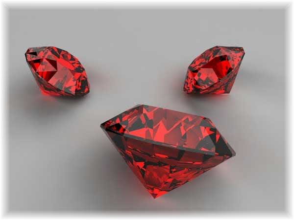

# Polymorphic Associations

## Objectives

* Define how polymorphic relationships work in the database
* Make migrations in rails that create polymorphic associations
* Write active record assocations to take advantage of the database structure

## What Are Polymorphic Associations?

A polymorphic association is useful when you a creating a table that can be associated with multiple other tables.  The classic example is comments.  A picture may be a table in your database as well as an event (think social media site).  You do not want to have to create a picture_comments table as well as an event_comments table since both tables will be identical except for the foreign key.  Instead we create 1 table and associate it to either the picture table or the event table depending on what the comment is for.

#### Exercise

In groups, research and discuss how the database could implement polymorphism.  Just like in normal active record associations, it is the database that is doing the association for us, so that is what matters.  After we have taken some time to discuss, a group will present their ideas.


## Migrations for Polymorphism

Now that we have an idea of how the database works, let's focus the rails setup.  Like we discussed previously, if a table (let's say our comments table), should be associated with multiple tables, it will need an id for the foreign key field as well as a type field to know which table the foreign key belongs to.  As a rails convention, you'd give both of these fields a name like `commentable_id` and `commentable_type`.

#### Exercise

Clone the [polymorphic association demo repo](https://github.com/wdi-sf-march-2014/polymorphic_association_demo).  The repo has a few tables defined (books, photos and videos) but sadly, no comments.  Your job is to create a coments table that can be associated to any of the other models.  Do not worry about the active record portion at this point.  Just get the `Comment` model and the migration generated.



#### Exercise Review

Many of you probably did something similar to the following:

```
rails g model Comment content:text commentable_id:integer commentable_type:string --no-test-framework
```

This will generate an emtpy `Comment` model and a migration that looks like this:

```
class CreateComments < ActiveRecord::Migration
  def change
    create_table :comments do |t|
      t.text :content
      t.integer :commentable_id
      t.string :commentable_type

      t.timestamps
    end
  end
end
```

This code is perfectly fine, and gets us the columns that we need in the database.  There is an easier way though!  Remove the two files that were created and do the following:

```
rails g model Comment content:text commentable:references{polymorphic} --no-test-framework
```
You should have two new files again.  In `app/model/comment.rb`, the model now looks like this:

```
class Comment < ActiveRecord::Base
  belongs_to :commentable, polymorphic: true
end
```

We'll talk more about the model file in the next section.


The migration looks like this:

```
class CreateComments < ActiveRecord::Migration
  def change
    create_table :comments do |t|
      t.text :content
      t.references :commentable, polymorphic: true, index: true

      t.timestamps
    end
  end
end
```

This migration is almost 100% equivalent to our previous migration.  It just does one extra thing which we didn't do: adding an index.  If you wanted to generate the same migration without using the generator or the polymorphic keyword, it might look like this:

```
class CreateComments < ActiveRecord::Migration
  def change
    create_table :comments do |t|
      t.text :content
      t.integer :commentable_id
      t.string :commentable_type

      t.timestamps
    end
    add_index :comments, [:commentable_id, :commentable_type]
  end
end
```

Either migration is fine, just make sure you understand what the migration is doing.


## ActiveRecord Support For Polymoric Associations

If you used the polymorphic generator in the previous example for the comments model, you should already have an `app/models/comment.rb` file that looks like the following: 

```
class Comment < ActiveRecord::Base
  belongs_to :commentable, polymorphic: true
end
```

The model belongs to commentable because there is no one table that it is associated with.  Instead it is associated with any table that is commentable.  The `polymorphic: true` tells active record that this is not a normal belongs to relationship, it is polymorphic.

Now you can go into `rails c` and create some comments that are associated with a book or photo.  Make sure you have run `rake db:seed` on the polymorphic demo app.  Then do:

```
b1 = Book.first
c1 = Comment.create(content: "A book about whales", commentable_id: b1.id, commentable_type: "Book")

p1 = Photo.first
c2 = Comment.create(content: "Kitty", commentable_id: p1.id, commentable_type: "Photo")
```

Now with the assocation we've added to the comment model, we can do the following:

```
c1.commentable  #gets the thing associated with this comment (a book)
c2.commentable  #gets the assocaited object (a photo)
```

The more useful association is in the other direction, so lets add some associations to the other models.  Add the following line to the other models:

```
  has_many :comments, as: :commentable
```

#### Exercise

Search in the docs for active record or the rails guide and see what methods we now have access to.  Also, what does `dependent: destroy` do? Create some books, photos and videos.  Add comments to them.  Delete some of the photos and videos.

#### Mini Lab

Finish up the app.  Add a controller for photos and videos.  Create some seed data for all of them.  Add a delete button for all the resources.  If you finish early, try creating books, photos and videos using nested resources.

	
## References

* [Rails Guide On Polymorphic Associations](http://guides.rubyonrails.org/association_basics.html#polymorphic-associations)
* [Polymorphic Associations Demo App](https://github.com/wdi-sf-march-2014/polymorphic_association_demo)
